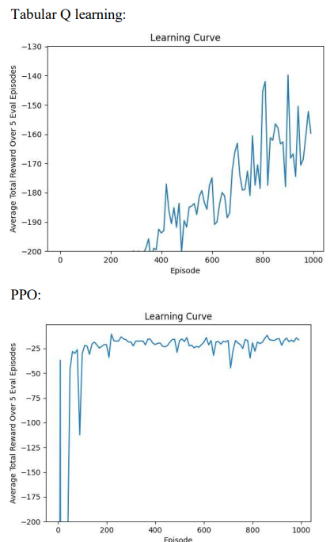
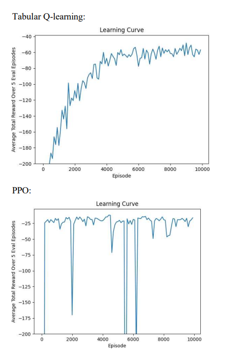

# PPO Reacher Solution

## Overview

The **PPO Reacher Solution** demonstrates the application of **Proximal Policy Optimization (PPO)** to solve the **Reacher-v4** problem in the **Gymnasium** environment. The goal is for the agent to control a 2D arm to reach a target, with training conducted over **100,000 episodes**.

## Achievements

- **Continuous Control**: The PPO agent successfully learns to control a 2D arm to reach random targets.
- **Stability**: After 10,000 episodes, the agent exhibits smooth and stable behavior in reaching targets, demonstrating robust performance.
- **Target Precision**: The agent not only reaches the target but also stays near it after reaching, maintaining its position with high accuracy.

## CLICK TO WATCH

## Results

**1000 training episodes**

**10 000 training episodes**
